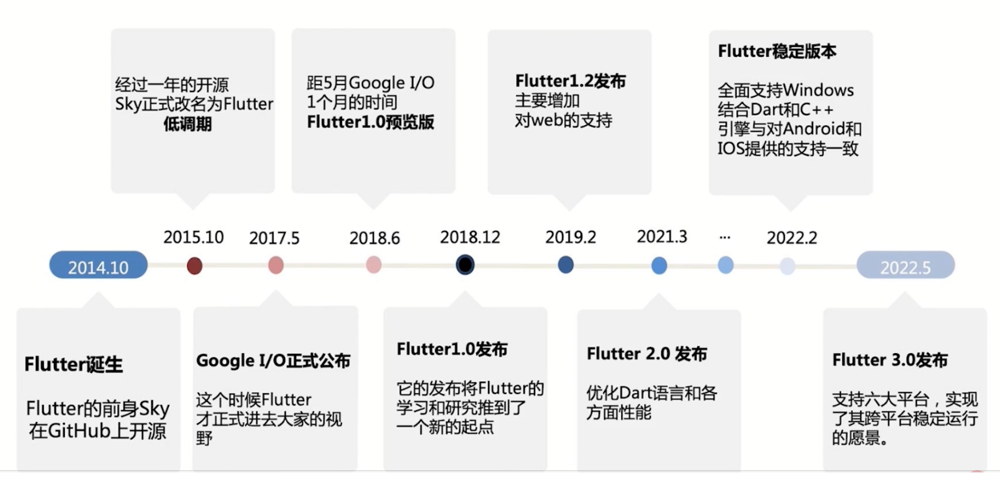
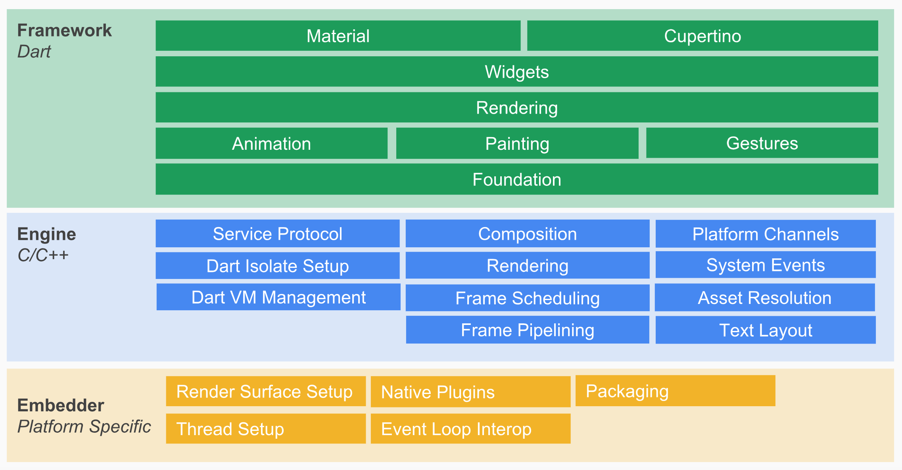
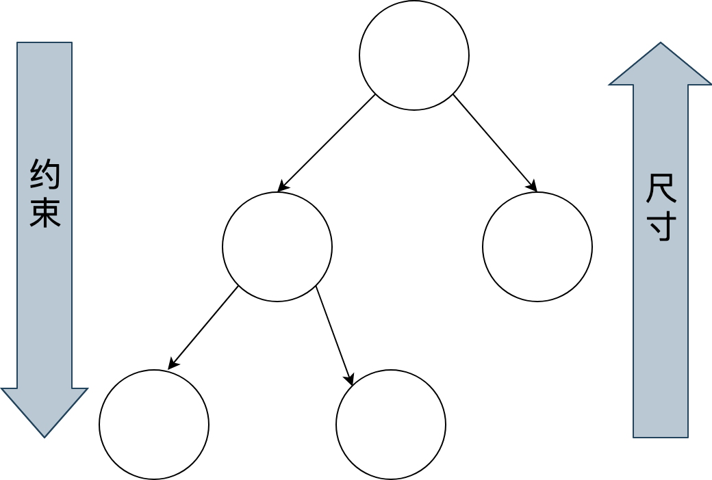
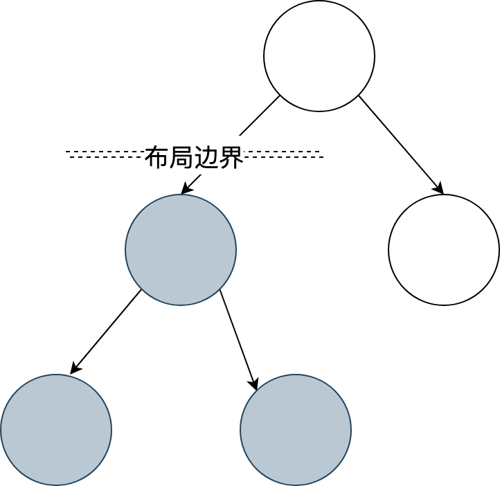
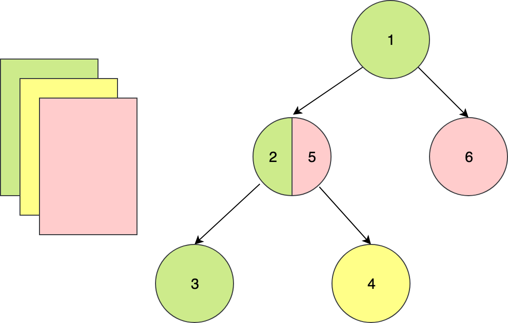
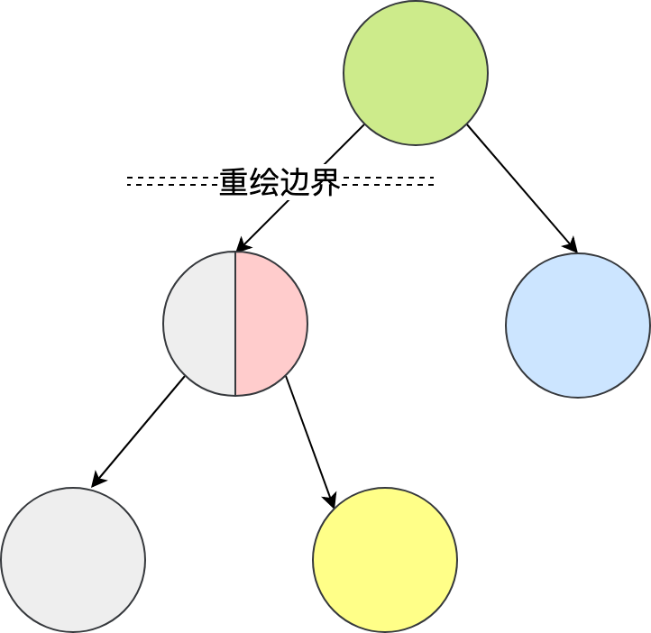

# Flutter 区别于其他方案的关键技术

## 1. Flutter 出现的历史背景

为不同的操作系统开发拥有相同功能的应用程序，开发人员只有两个选择：

1. 使用原生开发语言（即 Java 和 Objective-C），针对不同平台分别进行开发。

2. 使用跨平台解决方案，对不同平台进行统一开发。

原生开发方式的体验最好，但研发效率和研发成本相对较高；而跨平台开发方式研发虽然效率高，但为了抹平多端平台差异，各类解决方案暴露的组件和 API 较原生开发相比少很多，因此研发体验和产品功能并不完美。

所以最成功的跨平台开发方案其实是依托于浏览器控件的 Web。浏览器保证了 99% 的概率下 Web 的需求都是可以实现的，不需要业务将就“技术”。不过，Web 最大的问题在于它的性能和体验与原生开发存在肉眼可感知的差异，因此并不适用于对体验要求较高的场景。

对于用户体验更接近于原生的 React Native，对业务的支持能力却还不到浏览器的 5%，仅适用于中低复杂度的低交互类页面。面对稍微复杂一点儿的交互和动画需求，可能都要通过原生代码去扩展才能实现。

这些因素就导致了虽然跨平台开发从移动端诞生之初就已经被多次提及，但到现在也没有被很好地解决。

带着这些问题，我们终于迎来了本次课程的主角—— **Flutter**。

Flutter 是构建 Google 物联网操作系统 Fuchsia 的 SDK，主打**跨平台、高保真、高性能**。开发者可以通过 Dart 语言开发 App，一套代码可以同时运行在 iOS 和 Android 平台。 Flutter 使用 Native 引擎渲染视图，并提供了丰富的组件和接口，这无疑为开发者和用户都提供了良好的体验。

从 2017 年 5 月，谷歌公司发布的了 Alpha 版本的 Flutter，到 2022年5月发布的 Flutter 3.0，Flutter 正在赢得越来越多的关注。下面这张图展示了Flutter的前世今生。

:::center
图1 Flutter 发展时间线
:::

很多人开始感慨，跨平台技术似乎终于迎来了最佳解决方案。那么，接下来我们就从原理层面去看看，Flutter 是如何解决既有跨平台开发方案问题的。

## 2. Flutter 是怎么运转的？

与用于构建移动应用程序的其他大多数框架不同，Flutter 是重写了一整套包括底层渲染逻辑和上层开发语言的完整解决方案。这样不仅可以保证视图渲染在 Android 和 iOS 上的高度一致性（即高保真），在代码执行效率和渲染性能上也可以媲美原生 App 的体验（即高性能）。

这就是 Flutter 和其他跨平台方案的本质区别：

- React Native 之类的框架，只是通过 JavaScript 虚拟机扩展调用系统组件，由 Android 和 iOS 系统进行组件的渲染；
- Flutter 则是自己完成了组件渲染的闭环；

那么，**Flutter 是怎么完成组件渲染**的呢？这需要从图像显示的基本原理说起。

在计算机系统中，图像的显示需要 CPU、GPU 和显示器一起配合完成：CPU 负责图像数据计算，GPU 负责图像数据渲染，而显示器则负责最终图像显示。

CPU 把计算好的、需要显示的内容交给 GPU，由 GPU 完成渲染后放入帧缓冲区，随后视频控制器根据垂直同步信号（VSync）以每秒 60 次的速度，从帧缓冲区读取帧数据交由显示器完成图像显示。

操作系统在呈现图像时遵循了这种机制，而 Flutter 作为跨平台开发框架也采用了这种底层方案，下面这张示意图解释了 Flutter 的绘制原理。

:::center
图 2 Flutter 绘制原理
:::
可以看到，Flutter 关注如何尽可能快地在两个硬件时钟的 VSync 信号之间计算并合成视图数据，然后通过 Skia 交给 GPU 渲染：UI 线程使用 Dart 来构建视图结构数据，这些数据会在 GPU 线程进行图层合成，随后交给 Skia 引擎加工成 GPU 数据，而这些数据会通过 OpenGL 最终提供给 GPU 渲染。

在进一步学习 Flutter 之前，我们有必要了解下构建 Flutter 的关键技术，即 **Skia 和 Dart。**

## **3. Skia 是什么？**

要想了解 Flutter，你必须先了解它的底层图像渲染引擎 Skia。因为 Flutter 只关心如何向 GPU 提供视图数据，而 Skia 就是它向 GPU 提供视图数据的好帮手。

Skia 是一款用 C++ 开发的、性能彪悍的 2D 图像绘制引擎，其前身是一个向量绘图软件。2005 年被 Google 公司收购后，因为其出色的绘制表现被广泛应用在 Chrome 和 Android 等核心产品上。Skia 在图形转换、文字渲染、位图渲染方面都表现卓越，并提供了开发者友好的 API。

因此架构于 Skia 之上的 Flutter，也因此拥有了彻底的跨平台渲染能力。通过与 Skia 的深度定制及优化，Flutter 可以最大限度地抹平平台差异，提高渲染效率与性能。

底层渲染能力统一了，上层开发接口和功能体验也就随即统一了，开发者再也不用操心平台相关的渲染特性了。也就是说，Skia 保证了同一套代码调用在 Android 和 iOS 平台上的渲染效果是完全一致的。

## 4. 为什么是 Dart？

Dart 因为同时支持 AOT 和 JIT，所以具有运行速度快、执行性能好的特点。但Flutter 为什么选择了 Dart，而不是前端应用的准官方语言 JavaScript 呢？这个问题很有意思，但也很有争议。

很多人说，选择 Dart 是 Flutter 推广的一大劣势，毕竟多学一门新语言就多一层障碍。但 Google 公司给出的原因很简单也很直接：Dart 语言开发组就在隔壁，对于 Flutter 需要的一些语言新特性，能够快速在语法层面落地实现；而如果选择了 JavaScript，就必须经过各种委员会和浏览器提供商漫长的决议。

事实上，Flutter 的确得到了兄弟团队的紧密支持。每次 Dart 新版本的发布都包含了为 Flutter 量身定制的诸多改造。

当然，Google 公司选择使用 Dart 作为 Flutter 的开发语言，还有其他更有说服力的理由：

1. Dart 同时支持即时编译 JIT 和事前编译 AOT。在开发期使用 JIT，开发周期异常短，调试方式颠覆常规（支持有状态的热重载）；而发布期使用 AOT，本地代码的执行更高效，代码性能和用户体验也更卓越。

2. Dart 作为一门现代化语言，集百家之长，拥有其他优秀编程语言的诸多特性（比如，完善的包管理机制）。也正是这个原因，Dart 的学习成本并不高，很容易上手。

3. Dart 避免了抢占式调度和共享内存，可以在没有锁的情况下进行对象分配和垃圾回收，在性能方面表现相当不错。

Dart 是一门优秀的现代语言，最初设计也是为了取代 JavaScript 成为 Web 开发的官方语言，不过最后的结果可想而知。而随着 Flutter 的发布，Dart 开始转型，其自身定位也发生了变化，专注于改善构建客户端应用程序的体验，因此越来越多的开发者开始慢慢了解、学习这门语言，并共同完善它的生态，可以说是 Flutter 带动了 Dart。

## 5. Flutter 的原理

在了解了 Flutter 的基本运作机制后，我们再来深入了解一下 Flutter 的实现原理。

首先，我们来看一下 Flutter 的架构图。通过这张图以及对应的解读，我们应该在开始学习的时候就建立起对 Flutter 的整体印象，能够从框架设计和实现原理的高度去理解 Flutter 区别其他跨平台解决方案的关键所在，为后面的学习打好基础，而不是直接一上来就陷入语言和框架的功能细节“泥潭”而无法自拔。

:::center
图 3 Flutter 架构图
:::

备注：此图引自[ Flutter System Overview](https://docs.flutter.dev/resources/architectural-overview)

Flutter 架构采用分层设计，从下到上分为三层，依次为：**Embedder、Engine、Framework**

- Embedder 是操作系统适配层，实现了渲染 Surface 设置，线程设置，以及平台插件等平台相关特性的适配。从这里我们可以看到，Flutter 平台相关特性并不多，这就使得从框架层面保持跨端一致性的成本相对较低。
- Engine 层主要包含 Skia、Dart 和 Text，实现了 Flutter 的渲染引擎、文字排版、事件处理和 Dart 运行时等功能。Skia 和 Text 为上层接口提供了调用底层渲染和排版的能力，Dart 则为 Flutter 提供了运行时调用 Dart 和渲染引擎的能力。而 Engine 层的作用，则是将它们组合起来，从它们生成的数据中实现视图渲染。
- Framework 层则是一个用 Dart 实现的 UI SDK，包含了动画、图形绘制和手势识别等功能。为了在绘制控件等固定样式的图形时提供更直观、更方便的接口，Flutter 还基于这些基础能力，根据 Material 和 Cupertino 两种视觉设计风格封装了一套 UI 组件库。我们在开发 Flutter 的时候，可以直接使用这些组件库。

接下来，我们以界面渲染过程为例，来介绍 **Flutter 是如何工作的**。

页面中的各界面元素（Widget）以树的形式组织，即控件树。Flutter 通过控件树中的每个控件创建不同类型的渲染对象，组成渲染对象树。而渲染对象树在 Flutter 的展示过程分为四个阶段：布局、绘制、合成和渲染。

### **5.1 布局**

Flutter 采用深度优先机制遍历渲染对象树，决定渲染对象树中各渲染对象在屏幕上的位置和尺寸。在布局过程中，渲染对象树中的每个渲染对象都会接收父对象的布局约束参数，决定自己的大小，然后父对象按照控件逻辑决定各个子对象的位置，完成布局过程。

:::center
图 4 Flutter 布局过程
:::
为了防止因子节点发生变化而导致整个控件树重新布局，Flutter 加入了一个机制——布局边界（Relayout Boundary），可以在某些节点自动或手动地设置布局边界，当边界内的任何对象发生重新布局时，不会影响边界外的对象，反之亦然。

:::center
图 5 Flutter 布局边界
:::
### **5.2 绘制**

布局完成后，渲染对象树中的每个节点都有了明确的尺寸和位置。Flutter 会把所有的渲染对象绘制到不同的图层上。与布局过程一样，绘制过程也是深度优先遍历，而且总是先绘制自身，再绘制子节点。

以下图为例：节点 1 在绘制完自身后，会再绘制节点 2，然后绘制它的子节点 3、4 和 5，最后绘制节点 6。

:::center
图 6 Flutter 绘制示例
:::
可以看到，由于一些其他原因（比如，视图手动合并）导致 2 的子节点 5 与它的兄弟节点 6 处于了同一层，这样会导致当节点 2 需要重绘的时候，与其无关的节点 6 也会被重绘，带来性能损耗。

为了解决这一问题，Flutter 提出了与布局边界对应的机制——重绘边界（Repaint Boundary）。在重绘边界内，Flutter 会强制切换新的图层，这样就可以避免边界内外的互相影响，避免无关内容置于同一图层引起不必要的重绘。

:::center
图 7 Flutter 重绘边界
:::
重绘边界的一个典型场景是 Scrollview。ScrollView 滚动的时候需要刷新视图内容，从而触发内容重绘。而当滚动内容重绘时，一般情况下其他内容是不需要重绘的，这时候重绘边界就派上用场了。

### **5.3 合成和渲染**

终端设备的页面越来越复杂，因此 Flutter 的渲染树层级通常很多，直接交付给渲染引擎进行多图层渲染，可能会出现大量渲染内容的重复绘制，所以还需要先进行一次图层合成，即将所有的图层根据大小、层级、透明度等规则计算出最终的显示效果，将相同的图层归类合并，简化渲染树，提高渲染效率。

合并完成后，Flutter 会将几何图层数据交由 Skia 引擎加工成二维图像数据，最终交由 GPU 进行渲染，完成界面的展示。

接下来我们再看看学习 Flutter，都需要学习哪些知识。

## 6. 学习 Flutter 需要掌握哪些知识？

跨平台开发一定是未来大前端的趋势，我们应该拥抱变化。而 Flutter 提供了一套彻底的移动跨平台方案，也确实弥补了如今跨平台开发框架的短板，解决了业界痛点，极有可能成为跨平台开发领域的终极解决方案，前途非常光明。

那么我们**学习 Flutter 都需要掌握哪些知识**呢？

按照 App 的开发流程（开发、调试测试、发布与线上运维），本课程将 Flutter 的技术栈进行了划分，里面几乎包含了 Flutter 开发需要的所有知识点。掌握了这些知识点后，你也就具备了企业级应用开发的必要技能。

这些知识点，如下图所示：

:::center
图 8 Flutter 知识体系
:::
有了这张图，你是否感觉到学习 Flutter 的路线变得更加清晰了呢？

## 7. 小结

本篇了解了 Flutter 的历史背景与运行机制，并以界面渲染过程为例，从布局、绘制、合成和渲染四个阶段讲述了 Flutter 的实现原理。此外，还介绍了构建 Flutter 底层的关键技术：Skia 与 Dart，它们是 Flutter 有别于其他跨平台开发方案的核心所在。

最后梳理了一张 Flutter 学习思维导图，围绕一个应用的迭代周期介绍了 Flutter 相关的知识点。希望你对 Flutter 背后的设计原理和知识体系有所了解，对 Flutter 有一个整体感知。