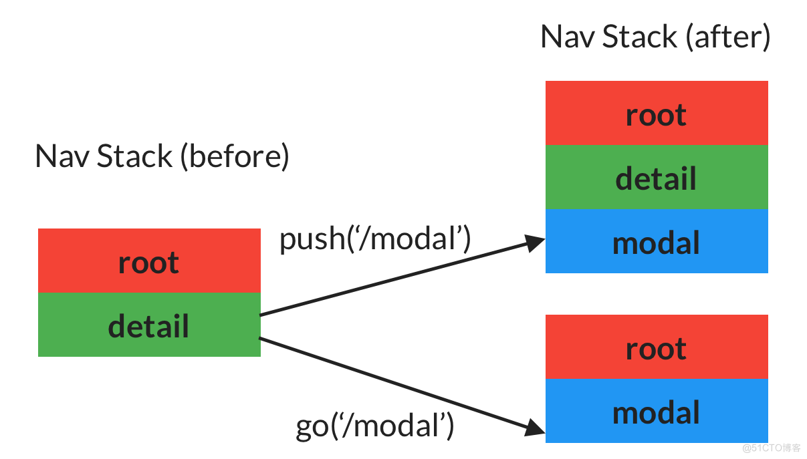

# go_router声明式路由

## 基本使用
### 声明路由
```dart
import 'package:flutter/material.dart';
import 'package:go_router/go_router.dart';

void main() => runApp(MyApp());
  class MyApp extends StatelessWidget {
  MyApp({Key? key}) : super(key: key);

  @override
  Widget build(BuildContext context) {
    return MaterialApp.router(
      routeInformationProvider: _router.routeInformationProvider,
      routeInformationParser: _router.routeInformationParser,
      routerDelegate: _router.routerDelegate,
      title: 'GoRouter Example',
      debugShowCheckedModeBanner: false,
      theme: ThemeData(
        primarySwatch: Colors.lightGreen,
      ),
    );
  }

  /// 定义声明式路由
  final GoRouter _router = GoRouter(
    errorBuilder: (context, state) => const Page404(), // 替换默认的错误
    // initialLocation: '/', // 初始化位置
    routes: <GoRoute>[
      GoRoute(
        path: '/',
        builder: (context, state) => const MyHomePage(title: 'Flutter Demo'),
        routes: [
          GoRoute(
            path: 'about',
            builder: (context, state) => const AboutPage(),
          ),
          GoRoute(
            path: 'setting',
            name: 'Setting',
            builder: (context, state) => const SettingPage(),
          ),
        ],
      ),
      GoRoute(
        path: '/index',
        name: 'Home',
        builder: (BuildContext context, GoRouterState state) {
          return const IndexPage();
        },
      ),
    ],
  );
}

```
### 使用
- go
- push
- pushName
- goName
```dart
OutlinedButton(
    onPressed: () => GoRouter.of(context).go('/about'),
    child: const Text('图片占位'),
),
OutlinedButton(
    // onPressed: () => context.goNamed('Home'),
    onPressed: () => context.pushNamed('Home'),
    child: const Text('Home'),
),
OutlinedButton(
    onPressed: () => GoRouter.of(context).push('/404'),
    child: const Text('404'),
),
OutlinedButton(
    onPressed: () => context.goNamed('Setting'),
    child: const Text('设置'),
),
```
### 命名路由
[Link](https://gorouter.dev/named-routes)


## 页面传参
[go_router：params](https://gorouter.dev/parameters)
[path_to_regexp 文档](https://pub.dev/documentation/path_to_regexp/latest/)
### params 动态链接
> 动态链接的想法是用户可以为应用添加这样的对象，每个对象获得一个自身的链接，例如，一个新的 family 获得一个新的链接。这正是路由参数能做到的，例如，一个新的 family 有它自身的 ID，可以在 family 路由中变量化时使用，例：路径：/family/:fid 。
```dart
/// 路由声明
GoRoute(
  path: 'user_center/:avatar&:name',
  name: 'UserCenter',
  builder: (context, state) {
    final String name = state.params['name']!;
    final String? avatar = state.params['avatar'];
    return UserCenter(
      name: name,
      avatar: avatar,
    );
  },
)
/// 路由传参
onPressed: () => context.goNamed(
  'UserCenter',
  params: {
    'name': 'lanyj',
    'avatar': 'http://img.w2gd.top/up/lem2.png'
  },
),
/// 参数获取
class UserCenter extends StatelessWidget {
  final String name;
  final String? avatar;
  const UserCenter({Key? key, required this.name, this.avatar})
      : super(key: key);

  @override
  Widget build(BuildContext context) {
    /// 当前位置
    final router = GoRouter.of(context).location;
    return Scaffold(
      appBar: AppBar(
        title: const Text('用户中心'),
      ),
      body: Center(
        child: Column(
          children: [
            Image.network(avatar!),

            // image: NetworkImage(avatar!),
            Text('用户名：$name'),
            Text('当前位置: $router')
          ],
        ),
      ),
    );
  }
}
```
:::center

:::

### queryParams 查询参数
```dart
/// 路由声明
GoRoute(
    path: 'setting',
    name: 'Setting',
    builder: (context, state) {
        final String? query = state.queryParams['query'];
        return SettingPage(query: query);
    },
)，

/// 路由传参
onPressed: () => context.go('/setting?query=柳三变'),

/// 参数获取
class SettingPage extends StatelessWidget {
  final String? query;
  const SettingPage({Key? key, this.query}) : super(key: key);

  @override
  Widget build(BuildContext context) {
    return Scaffold(
      appBar: AppBar(
        title: const Text('appbarTitle'),
      ),
      body: Center(
        child: Text(
          'Setting Page: $query',
          style: const TextStyle(color: Colors.red, fontSize: 34),
        ),
      ),
    );
  }
}
```
### extra 附加参数
除了传递路径参数和查询参数之外，也可以传递附加的对象作为导航的一部分。
```dart
/// 对象类
class User {
  final String name;
  final String avatar;
  final int age;
  final String location;

  User(this.name, this.avatar, this.age, this.location);
}
```
```dart
/// 路由声明
GoRoute(
  path: 'user_data',
  name: 'UserData',
  builder: (context, state) {
    return UserData(user: state.extra! as User);
  },
),
/// 路由传对象
ElevatedButton(
  onPressed: () => context.pushNamed(
    'UserData',
    extra:
        User('LanYJ', 'http://img.w2gd.top/up/lem2.png', 16, '异世界'),
  ),
  child: const Text('个人资料'),
)
/// 获取对象
class UserData extends StatelessWidget {
  final User user;
  const UserData({Key? key, required this.user}) : super(key: key);

  @override
  Widget build(BuildContext context) {
    return Scaffold(
      appBar: AppBar(
        title: const Text('个人资料'),
      ),
      body: Column(
        children: [
          ListTile(
            leading: Container(
              height: 45,
              width: 45,
              decoration: BoxDecoration(
                shape: BoxShape.circle,
                image: DecorationImage(
                  image: NetworkImage(user.avatar),
                  fit: BoxFit.fill,
                ),
              ),
            ),
            title: Text(user.name),
            subtitle: Text(user.location),
          ),
          ListTile(
            leading: const Icon(Icons.map),
            title: Text(user.age.toString()),
          ),
        ],
      ),
    );
  }
}
```

:::center

:::

## Go 与 Push的区别
```
-| root
  -| detail
  -| modal 
```



将 go 视为跳到新路线的一种方式。 如果新路由不是旧路由的子路由，这将修改底层导航堆栈。

另一方面，push 将始终将目标路由推送到现有导航堆栈的顶部

## 参考
- [pub.dev: go_router](https://pub.dev/packages/go_router)
- [[译]Flutter Favorite之路由包go_router - 基础篇](https://juejin.cn/post/7047035390003249189)
- [官方文档](https://gorouter.dev/)
- [使用 GoRouter ：Go 与 Push的区别](https://blog.51cto.com/jianguo/5258729)