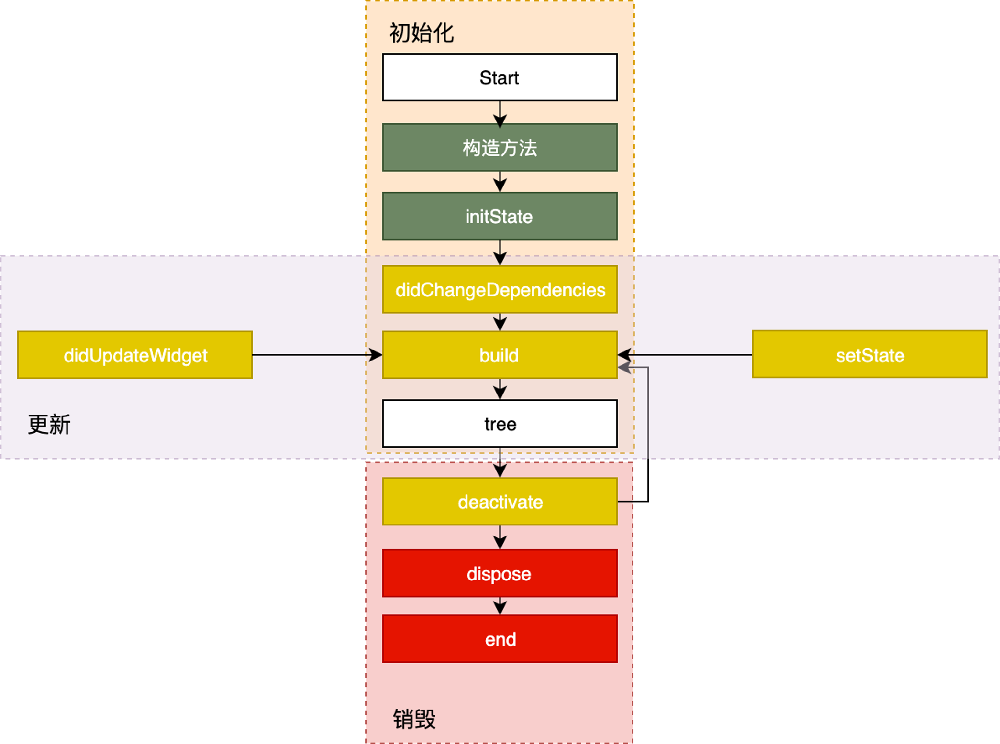
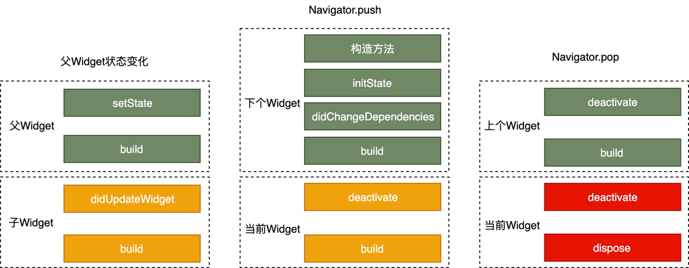
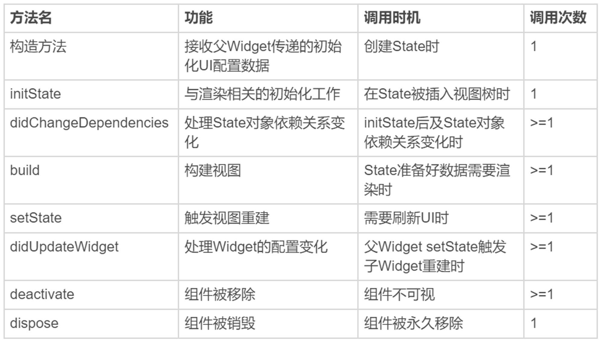
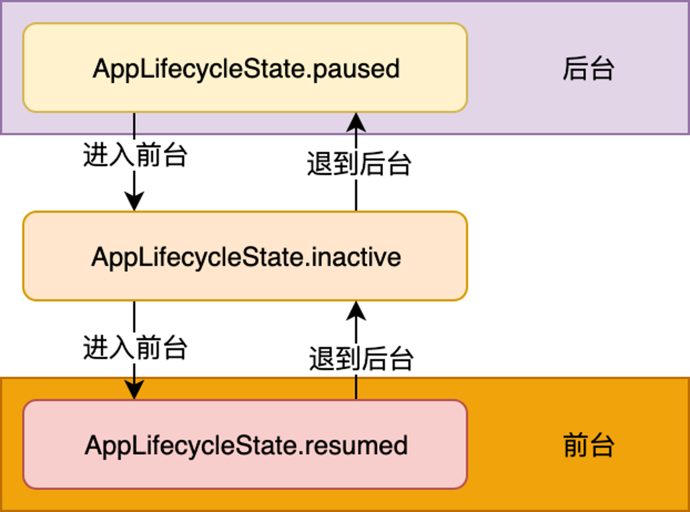

## state的生命周期

State 的生命周期可以分为 3 个阶段
- `创建`（插入视图树）：State 初始化时会依次执行 ：构造方法 -> initState -> didChangeDependencies -> build，随后完成页面渲染。
- `更新`（在视图树中存在）： Widget 的状态更新，主要由 3 个方法触发：setState、didchangeDependencies 与 didUpdateWidget。
- `销毁`（从视图树中移除）：组件被移除或是页面销毁的时候，系统会调用 deactivate 和 dispose 这两个方法，来移除或销毁组件


:::center
State生命周期图
:::

---


:::center
几种常见场景下State生命周期图
:::

---


:::center
State生命周期中方法调用对比
:::

## App的生命周期



- 有时我们需要在对应的 App 生命周期事件中做相应处理，比如 App 从后台进入前台、从前台退到后台，或是在 UI 绘制完成后做一些处理。
- 原生：重写 Activity、ViewController 生命周期回调方法，或是注册应用程序的相关通知，来监听 App 的生命周期并做相应的处理
- Flutter：可以使用 WidgetsBindingObserver 类
    - 生命周期回调
    - 帧绘制回调


## Demo 监听State生命周期

```dart
import 'package:flutter/material.dart';
/// @Description  生命周期
class Page1 extends StatefulWidget {
  const Page1({Key? key}) : super(key: key);

  @override
  State<Page1> createState() => _Page1State();
}

class _Page1State extends State<Page1> with WidgetsBindingObserver {
  // 当 Widget第一次插入到 Widget 树时会被调用。对于每一个State对象，Flutter只会调用一次该回调
  @override
  void initState() {
    super.initState();
    print("page1 initState......");
    WidgetsBinding.instance.addObserver(this); //注册监听器

    WidgetsBinding.instance.addPostFrameCallback((_) {
      print("单次Frame绘制回调"); //只回调一次
    });

    WidgetsBinding.instance.addPersistentFrameCallback((_) {
      print("实时Frame绘制回调"); //每帧都回调
    });
  }

  @override
  void setState(fn) {
    super.setState(fn);
    print("page1 setState......");
  }

  /*
  *初始化时，在initState之后立刻调用
  *当State的依赖关系发生变化时，会触发此接口被调用
  */
  @override
  void didChangeDependencies() {
    super.didChangeDependencies();
    print("page1 didChangeDependencies......");
  }

  @override
  Widget build(BuildContext context) {
    print("page1 build......");
    return Scaffold(
      appBar: AppBar(title: const Text("Lifecycle demo")),
      body: Center(
        child: Column(
          children: <Widget>[
            ElevatedButton(
              child: const Text("打开/关闭新页面查看状态变化"),
              onPressed: () => Navigator.push(
                context,
                MaterialPageRoute(builder: (context) => const Parent()),
              ),
            )
          ],
        ),
      ),
    );
  }

  //状态改变的时候会调用该方法,比如父类调用了setState
  @override
  void didUpdateWidget(Page1 oldWidget) {
    super.didUpdateWidget(oldWidget);
    print("page1 didUpdateWidget......");
  }

  //当State对象从树中被移除时，会调用此回调
  @override
  void deactivate() {
    super.deactivate();
    print('page1 deactivate......');
  }

  //当State对象从树中被永久移除时调用；通常在此回调中释放资源
  @override
  void dispose() {
    super.dispose();
    print('page1 dispose......');
    WidgetsBinding.instance.removeObserver(this); //移除监听器
  }

  //监听App生命周期回调
  @override
  void didChangeAppLifecycleState(AppLifecycleState state) async {
    print(">>>>>>>>>>>>>>> $state");
    if (state == AppLifecycleState.resumed) {
      //do sth
    }
  }
}

```


