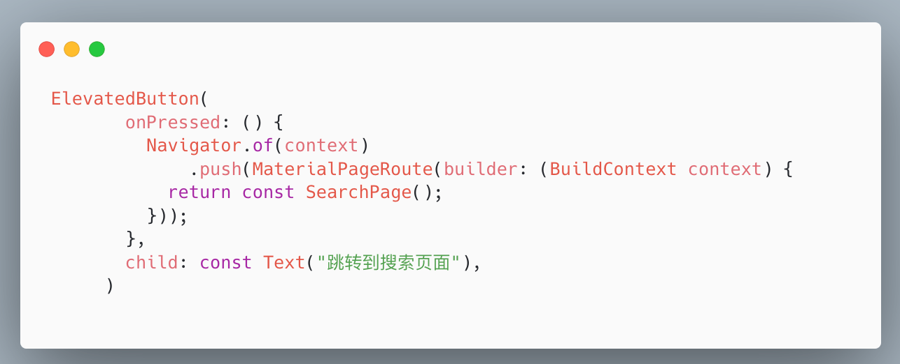
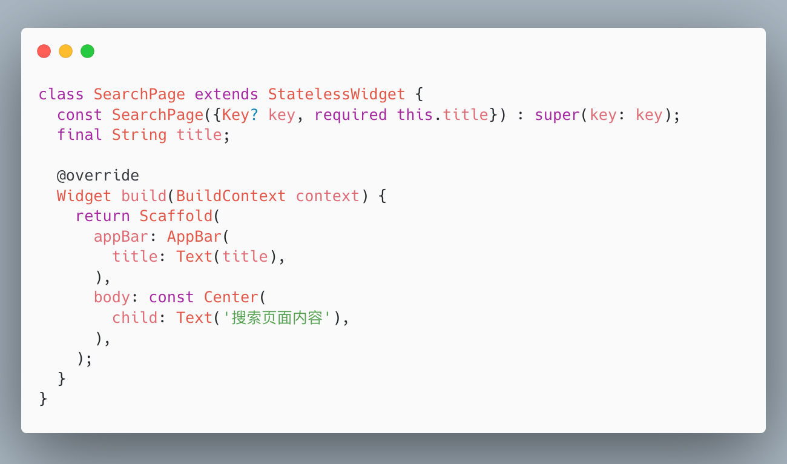
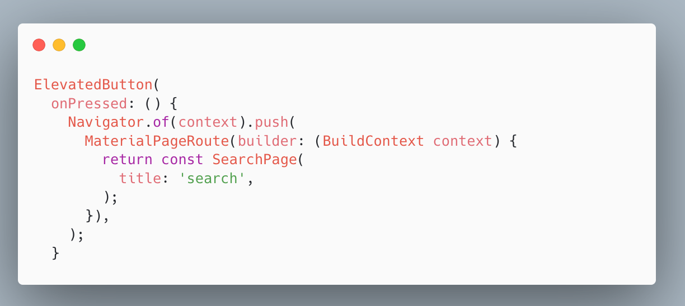
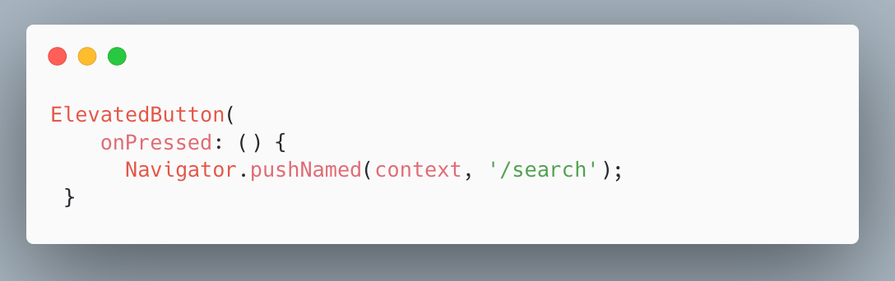
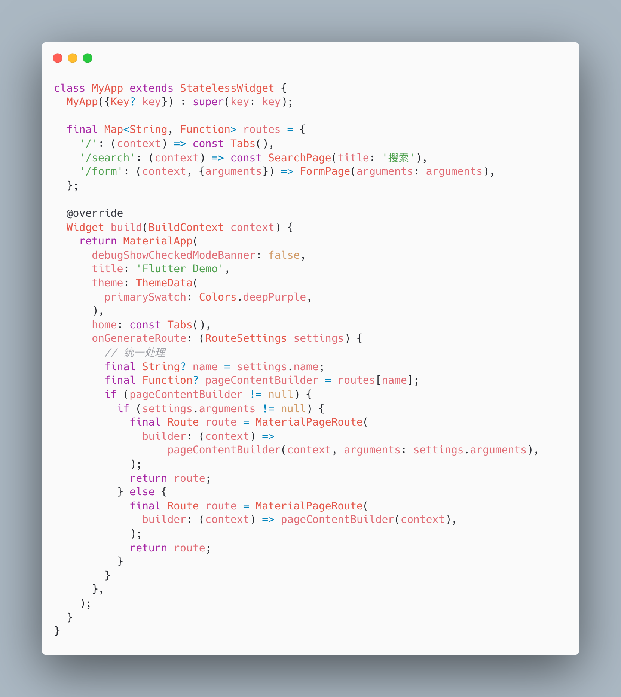
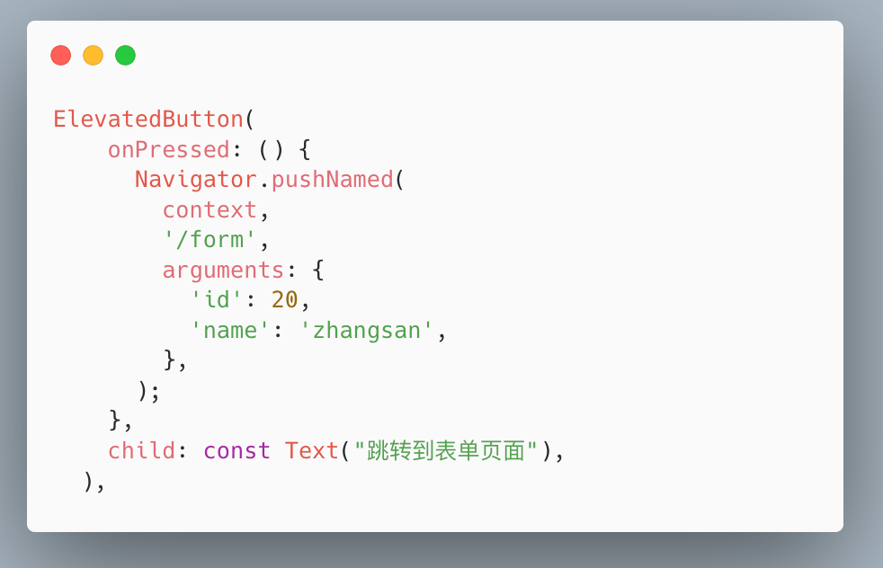
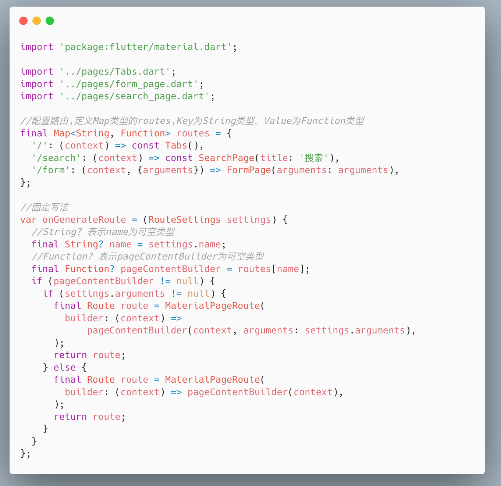

# 普通路由、命名路由、路由传值

## 一、Flutter 中的路由

Flutter 中的路由通俗地讲就是页面跳转。在 Flutter 中通过 Navigator 组件管理路由导航。并提供了管理堆栈的方法。如:Navigator.push 和 Navigator.pop。

Flutter 中给我们提供了两种配置路由跳转的方式:1、基本路由 2、命名路由。

## 二、基本路由使用

我们现在想从 HomePage 组件跳转到 SearchPage 组件。

1、编写SearchPage页面，并在 HomPage 中引入

2、在 HomePage 中通过下面方法跳转



## 三、基本路由跳转传值

从 HomePage 组件跳转到 SearchPage 组件，并传值。

给SearchPage类添加可选参数



HomePage跳转的时候，通过构造方法传值。



运行效果


## 四、命名路由

### 1、配置路由

在main中配置路由


### 2、路由跳转



## 五、命名路由跳转传值

官方文档：[https://docs.flutter.dev/cookbook/navigation/navigate-with-arguments](https://docs.flutter.dev/cookbook/navigation/navigate-with-arguments?_from_=227020040_59851621_233928268_4aeb228b6d4078d6b5e2a90705729d99&_from_=227020040_59851621_233928268_4aeb228b6d4078d6b5e2a90705729d99)

### 1、配置路由:




### 2、路由跳转 

 

### 3、接收参数

FormPage 页面接收参数


### 4、运行效果


## 六、将命名路由单独抽离到一个文件

新建一个 routes.dart 文件，将命名路由抽取到里面，写入以下代码，统一维护路由。



在main.dart 中调用：


## 七、给特定的 route 传参

> 1. 定义需要传递的参数，也可以直接用包含这些参数的 Widget
```dart
class AppListItem {
  final String title;
  final String subTitle;
  final String bgImg;

  AppListItem(this.title, this.subTitle, this.bgImg);
}
```
> 2. 传递参数到目标路由
```dart
Navigator.pushNamed(
    context, '/detail',
    arguments: AppListItem('title', 'subTitle', 'http://img/lem2.png')
);
```
> 3. 在目标页面获取参数

ModalRoute.of() 方法，这个方法返回的是当前路由及其携带的参数。
```dart
@override
  Widget build(BuildContext context) {
    // settings and cast them as AppListItem.
    final args = ModalRoute.of(context)!.settings.arguments as AppListItem;

    return Scaffold(
      appBar: AppBar(
        title: Text(args.title),
      ),
      body: Center(
        child: Text(args.subTitle),
      ),
    );
  }
```


## 参考文档
- [导航到对应名称的 routes 里](https://flutter.cn/docs/cookbook/navigation/named-routes)
- [Flutter当前路由属性详解 - 简书](https://juejin.cn/post/6844904017655496717)
- [给特定的 route 传参](https://flutter.cn/docs/cookbook/navigation/navigate-with-arguments)
- [Navigator&页面传值Flutter](https://cloud.tencent.com/developer/article/1858183)
