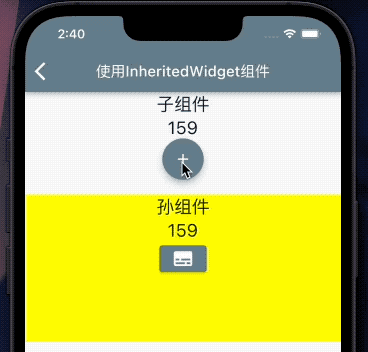
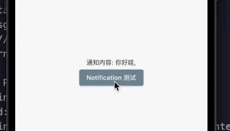
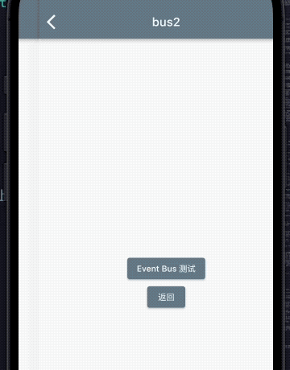

| 传值方法 | 优点 | 缺点 |
| :-- | :-- | :-- |
| 属性传值 | 使用简单 | 跨越很多层传递给子组件繁琐而且冗余 |
| InheritedWidget |  跨多个父子节点方便| 修改数据麻烦，传值方向的单一，从上往下 |
| Notification | 向上传递事件方便| 监听通知读取麻烦，传值方向的单一，从下往上|
| EventBus | 订阅、发布。全局使用，无需组件间存在父子关系| 要订阅和解订阅，效率不高|

## InheritedWidget
- InheritedWidget是Flutter中的一个功能型Widget,适用于在Widget树中共享数据的场景。通过它，我们可以高效地将数据在Vidget树中进行跨层传递。
- Theme类是通过InheritedWidget实现的典型案例

以Flutter工程模板中的计数器为例，来说明InheritedWidget的使用方法
::: center

:::

::: details 创建父组件

```dart
import 'package:demo_codelab/pages/widget/zjcz/counter_demo_page.dart';
import 'package:flutter/cupertino.dart';

class CounterContainer extends InheritedWidget {
  // 方便子widget 能在widget树中找到它
  static CounterContainer of(BuildContext context) =>
      context.dependOnInheritedWidgetOfExactType<CounterContainer>() as CounterContainer;

  final CounterDemoPageState model; // 直接使用 CounterDemoPage 中的状态类，来获取数据
  final Function() increment;

  CounterContainer({Key? key, required this.model, required this.increment, required Widget child})
      : super(key: key, child: child);

  // 判断是否更新
  @override
  bool updateShouldNotify(CounterContainer oldWidget) {
    // return count != oldWidget.count;
    return model != oldWidget.model;
  }
}

```
:::

::: details  子孙组件获取父组件的传值

```dart
import 'package:demo_codelab/pages/widget/zjcz/counter_container.dart';
import 'package:flutter/material.dart';

class CounterDemoPage extends StatefulWidget {
  const CounterDemoPage({Key? key}) : super(key: key);

  @override
  State<CounterDemoPage> createState() => CounterDemoPageState();
}

class CounterDemoPageState extends State<CounterDemoPage> {
  int count = 100;

  void _addCounter() => setState(() {
        count++;
      });

  void reduceCounter() => setState(() {
        count--;
      });

  @override
  Widget build(BuildContext context) {
    return Scaffold(
      appBar: AppBar(
        title: const Text('使用InheritedWidget组件'),
      ),
      body: CounterContainer(
        model: this,
        increment: _addCounter,
        child: CounterWidget(),
      ),
    );
  }
}

/// 子组件
class CounterWidget extends StatelessWidget {
  const CounterWidget({Key? key}) : super(key: key);

  @override
  Widget build(BuildContext context) {
    // 获得父组件节点
    CounterContainer state = CounterContainer.of(context);
    return Column(
      children: [
        Text('子组件', style: Theme.of(context).textTheme.headline5),
        Center(
          child: Text(
            '${state.model.count}',
            style: Theme.of(context).textTheme.headline5,
          ),
        ),
        FloatingActionButton(onPressed: state.increment, child: Icon(Icons.add)),
        SizedBox(height: 20),
        Container(
          color: Colors.yellowAccent,
          height: 200,
          width: MediaQuery.of(context).size.width,
          child: Grandson(),
        )
      ],
    );
  }
}

/// 孙组件
class Grandson extends StatelessWidget {
  const Grandson({Key? key}) : super(key: key);

  @override
  Widget build(BuildContext context) {
    // 获得祖父组件节点
    CounterContainer state = CounterContainer.of(context);
    return Column(
      children: [
        Text('孙组件', style: Theme.of(context).textTheme.headline5),
        Text(state.model.count.toString(), style: Theme.of(context).textTheme.headline5),
        ElevatedButton(onPressed: () => state.model.reduceCounter(), child: Icon(Icons.subtitles))
      ],
    );
  }
}
```
:::

## Notification

::: center

:::
::: details 抽离出一个子 widget 用来发通知
```dart
import 'package:flutter/material.dart';

class CustomNotification extends Notification {
  final String msg;
  CustomNotification(this.msg);
}

// 抽离出一个子 widget 用来发通知
class CustomChild extends StatelessWidget {
  const CustomChild({Key? key}) : super(key: key);

  @override
  Widget build(BuildContext context) {
    return ElevatedButton(
      onPressed: () => CustomNotification('你好哇').dispatch(context),
      child: const Text('Notification 测试'),
    );
  }
}
```
:::

::: details 通知父组件
```dart
import 'package:demo_codelab/pages/widget/zjcz/custom_notification.dart';
import 'package:flutter/material.dart';

class NotificationDemoPage extends StatefulWidget {
  const NotificationDemoPage({Key? key}) : super(key: key);

  @override
  State<NotificationDemoPage> createState() => _NotificationDemoPageState();
}

class _NotificationDemoPageState extends State<NotificationDemoPage> {
  String _msg = '通知内容: ';
  @override
  Widget build(BuildContext context) {
    return Scaffold(
      appBar: AppBar(
        title: const Text('Notification练习'),
      ),
      body: Center(
        child: NotificationListener<CustomNotification>(
          onNotification: (notification) {
            setState(() {
              _msg += '${notification.msg},';
            }); // 收到子widget通知，更新msg
            return true;
          },
          child: Padding(
            padding: const EdgeInsets.all(16),
            child: Column(
              mainAxisAlignment: MainAxisAlignment.center,
              children: [
                Text(_msg),
                CustomChild(), // 将子widget加入到视图中
              ],
            ),
          ),
        ),
      ),
    );
  }
}
```
:::

## event_bus
不止于 `父传子` 和`子传父`，可任意传，兄弟传，表亲传
```
flutter pub add event_bus
```
::: center

:::
::: details 定义消息类
```dart
import 'package:event_bus/event_bus.dart';

class CustomEvent {
  String msg;
  CustomEvent(this.msg);
}

EventBus eventBus = EventBus();
```
:::
::: details  接收页
```dart
import 'dart:async';

import 'package:demo_codelab/pages/widget/zjcz/cutom_event.dart';
import 'package:demo_codelab/pages/widget/zjcz/event_bus2_page.dart';
import 'package:flutter/material.dart';

class EventBusPage extends StatefulWidget {
  const EventBusPage({Key? key}) : super(key: key);

  @override
  State<EventBusPage> createState() => _EventBusPageState();
}

class _EventBusPageState extends State<EventBusPage> {
  String msg = "通知内容： ";
  late StreamSubscription subscription;

  @override
  void initState() {
    // 监听 CustomEvent事件，刷新UI
    subscription = eventBus.on<CustomEvent>().listen((event) {
      // print(event);
      setState(() {
        msg += event.msg;
      });
    });
    super.initState();
  }

  @override
  void dispose() {
    subscription.cancel(); // State销毁时，清理注册
    super.dispose();
  }

  @override
  Widget build(BuildContext context) {
    return Scaffold(
      appBar: AppBar(
        title: const Text('EventBus'),
      ),
      body: Column(
        children: [
          Text(
            msg,
            style: Theme.of(context).textTheme.headline6,
          ),
        ],
      ),
      floatingActionButton: FloatingActionButton(
        onPressed: () {
          Navigator.of(context).push(MaterialPageRoute(builder: (context) {
            return const EventBus2();
          })).then((value) {
            setState(() {
              if (value != null) {
                msg = (value as String?)!;
              }
            });
          });
        },
        child: const Icon(Icons.send),
      ),
    );
  }
}
```
:::

::: details 发送页
```dart
import 'package:demo_codelab/pages/widget/zjcz/cutom_event.dart';
import 'package:flutter/material.dart';

class EventBus2 extends StatelessWidget {
  const EventBus2({Key? key}) : super(key: key);

  @override
  Widget build(BuildContext context) {
    return Scaffold(
      appBar: AppBar(
        title: const Text('bus2'),
      ),
      body: Column(
        mainAxisAlignment: MainAxisAlignment.center,
        children: [
          Center(
            child: ElevatedButton(
              onPressed: () => eventBus.fire(CustomEvent("你好")),
              child: const Text('Event Bus 测试'),
            ),
          ),
          ElevatedButton(
            onPressed: () => Navigator.pop(context, 'hello'),
            child: const Text('返回'),
          ),
        ],
      ),
    );
  }
}
```
:::

::: tip
该demo 中还包含了`页面关闭时告知上一页面` 的回调方法，在 `Navigator.of(context).push`的 then 里
:::
