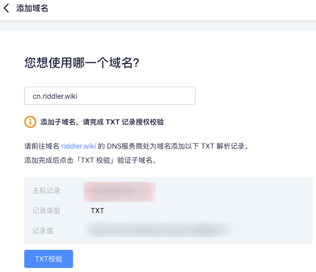
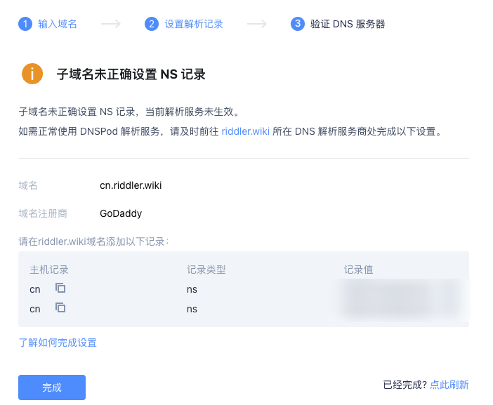

记录下如何购买国外域名并用国内的 DNS 解析。

<!-- more -->

由于原先的国内域名`w2gd.top`的备案已失效，重新备案要购买云服务器，反正域名也要过期了，于是想购买其他地区的域名来使用。

> 而且备案特别事儿逼，用途是博客，那么网站标题就得叫"我的博客"，😅 审核通过了大半年了，还打电话来通知我改回去，可能我没理，就直接备案失效了。

## 购买域名

起初在 asiaregister 的官网下面有支付宝图标，但是我选好域名准备付款时发现只有信用卡选项......到晚上发现我账号被禁用了，下单了没付款就这样子对我吗 😅？然后去 [Godaddy](https://www.godaddy.com/zh-sg)购买了域名`riddler.wiki`。

然后在[管理页面](https://www.godaddy.com/zh-sg)就可以设置`DNS记录`和`301转发`了。但是 Godaddy 提供的域名服务器被墙内屏蔽了，所以网站需要梯子，若想要被没有梯子的其他人看到，该怎么办呢？

## 解决 Godaddy 域名 DNS 不稳定的方法

优解：需要更换一个国内的 DNS 解析，例如使用腾讯云的[DNSPod](https://console.dnspod.cn/) 。

- 先注册 DNSPod，首先需要有一个 DNSPod 的账户
- 在总览页添加你的域名
- 之后会得到提示显示你的 DNS 解析服务器不是 DNSPod，记住 DNSPod 所给的两个服务器地址，这是关键
- 打开 Goddady，进入你的 DNS 管理页面，Manage DNS
- 更改解析服务器为上面 DNSPod 所给的两个服务器地址，Charge 保存，等待几分钟后生效
- 回到 DNSPod，进行解析服务即可

注意：原有的 Goddady 上的解析记录清零，需要重新在 DNSPod 上解析（或者扫描已有记录来导入数据）。这样就可以用腾讯云的免费服务来解析墙外的域名了，免费的套餐速度也还 ok，若嫌慢可以购买付费服务。但也有个问题，就是不备案的话就无法使用重定向功能，况且境外服务商的域名也无法备案。

那么就设置子域名来绑定 DNSPod 的解析，例如我在 DNSPod 添加 `cn.riddler.wiki`域名，会出现提示，让我去原服务商处添加 TXT 校验。

添加完毕后，继续按照提示设置 ，到 Goddady 上给子域名 cn 设置两条 NS 类型解析。

设置完毕，就可以在 DNSPod 上给 `cn.riddler.wiki` 设置 dns 解析了，但是测试后发现，给 Vercel 上的项目绑定子域名后，依然需要梯子才能访问...今天白干。
