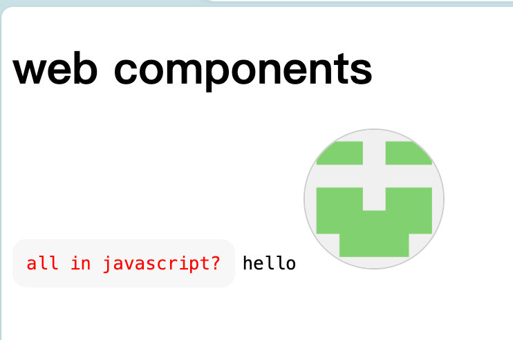
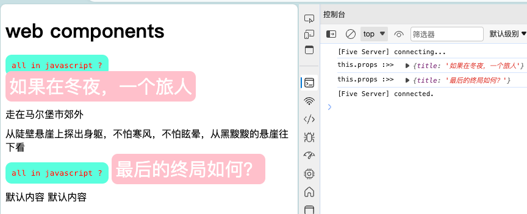
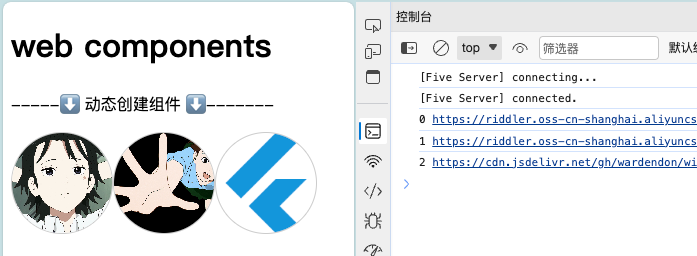

## 前言

偶然发现了 [ofa.js](https://ofajs.com/cn/index.html) ，基于 `Web Components` 开发的框架，感觉有点意思。简单了解了下 `Web Components`，我试试能不能也写一个函数来把 html 文件转换成 web 组件，最终也实现了部分功能，若你有兴趣，欢迎按照文档尝试。
::: tip Shadow DOM
影子 DOM（Shadow DOM）是 Web 组件（Web Components）的一个重要特性，它可以将标记（markup）、样式（styles）和行为（behaviors）隐藏起来，并与主文档隔离，防止外部的 CSS 和 JavaScript 影响组件内部的元素。

影子 DOM 有两种模式：'open' 和 'closed'。'open' 模式允许你通过元素的 shadowRoot 属性访问影子 DOM，而 'closed' 模式则不允许。
:::

## 封装 HTML 组件

首先，用 模版语法写一个 h5 组件，模版结构类似 Vue

```html
<!-- code-comp.html -->
<template>
  <code class="code">all in javascript?</code>
</template>
<script></script>
<style>
.code {
  color: red;
  background-color: #f7f7f7;
  border-radius: 10px;
  padding: 10px;
}
</style>
```

写一个工具类，用于动态加载组件并解析，创建一个 `Web Component` 实例

```js
/**
 * 动态加载组件并解析
 */
async function loadComponent(path) {
  // 初始化缓存对象
  loadComponent.caches = loadComponent.caches || {};

  // 缓存存在，直接返回
  if (loadComponent.caches[path]) {
    return loadComponent.caches[path];
  }

  // 获取组件内容
  const res = await fetch(path).then((res) => res.text());

  // 利用DOMParser解析HTML
  const parser = new DOMParser();
  const doc = parser.parseFromString(res, "text/html");

  // 解析模板、脚本和样式
  const template = doc.querySelector("template");
  const script = doc.querySelector("script");
  const style = doc.querySelector("style");
  // 缓存内容
  loadComponent.caches[path] = {
    template,
    script,
    style,
  };
  // 返回内容
  return loadComponent.caches[path];
}

/**
 * 创建自定义组件
 */
function createCustomElement(path, name) {
  class CustomComponent extends HTMLElement {
    async connectedCallback() {
      // 加载组件
      const componentInfo = await loadComponent(path);
      const shadowRoot = this.attachShadow({ mode: "open" });
      // 添加组件内容
      this.#addElements(shadowRoot, componentInfo);
    }

    disconnectedCallback() {
      console.log("生命周期:disconnectedCallback");
      this.shadowRoot.innerHTML = "";
      // 清理可能的事件监听器、定时器等，以防止内存泄漏
      //...
    }

    // 添加组件内容
    #addElements(shadowRoot, componentInfo) {
      // 添加模板内容
      if (componentInfo.template) {
        shadowRoot.appendChild(componentInfo.template.content.cloneNode(true));
      }
      // 添加脚本
      if (componentInfo.script) {
        // 防止全局污染，并获得根节点
        const fun = new Function(`${componentInfo.script.textContent}`);
        // 绑定脚本的 this 为当前的影子根节点
        fun.bind(shadowRoot)();
      }
      // 添加样式
      if (componentInfo.style) {
        shadowRoot.appendChild(componentInfo.style);
      }
    }
  }
  customElements.define(name, CustomComponent);
}

class WD extends HTMLElement {
  connectedCallback() {
    // 获取组件的路径
    const path = this.getAttribute("path");
    // 自定义的Web组件名称必须包含至少一个短划线（-）。这是HTML规范的一部分。
    const name = this.getAttribute("name") || path.split('/').pop().split('.')[0];
    // 创建一个新的 CustomComponent 实例
    createCustomElement(path, name);
  }
}
customElements.define("c-component", WD);
```

在这个工具类里，先定义了一个`c-component`组件，需要接收一个`path`属性（html 组件路径）,和一个`name`属性（可选，默认为组件的文件名），然后调用`createCustomElement`方法创建一个新的组件实例。`loadComponent`方法用于解析组件的模版、脚本和样式，最终生成的 `shadow dom` 自带样式隔离。
重点在于如何在页面里使用组件，需要先注册再使用，使用方式如下：

```html
<!-- index.html -->
<!DOCTYPE html>
<html lang="en">
<head>
  <meta charset="UTF-8">
  <meta name="viewport" content="width=device-width, initial-scale=1.0">
  <title>Document</title>
  <script src="./utils/utils.js"></script>
</head>

<body>
  <h1 class="code">web components</h1>
  <!-- 注册组件：name非必传，默认使用文件名称作为组件名 自定义的Web组件名称必须包含至少一个短划线（-）。这是HTML规范的一部分-->
  <c-component path="./components/code-comp.html" name="code-comp"></c-component>
  <c-component path="./components/w-avatar.html"></c-component>
  <!-- 使用组件 -->
  <code-comp></code-comp>
  <code class="code">hello</code>
  <w-avatar></w-avatar>
</body>
</html>
```


可以看到，hello 字符串的样式并没有受到`code-comp`组件里样式影响。

## 引入外部样式

要在 Web Components 中引入外部 CSS 样式，您可以通过几种不同的方法来实现。下面是两种常见的方法：

### 方法 1：使用 `<link>` 标签

在您的组件的 `<template>` 标签中，您可以使用 `<link>` 标签来引入外部 CSS 文件。这种方法适用于那些您想要应用于组件内部的全局样式。

```html
<template>
  <link rel="stylesheet" href="path/to/external-styles.css">
  <!-- 组件的其余内容 -->
</template>
```

### 方法 2：使用 `@import` 在 `<style>` 标签中

在组件的 `<style>` 标签中，您可以使用 CSS 的 `@import` 规则来引入外部样式表。这也允许您将外部样式应用于组件内部。

```html
<style>
  @import url('path/to/external-styles.css');
  /* 组件的其他样式 */
</style>
```

### 注意事项

- **封装性**：使用这些方法时，请记住 Web Components 的样式封装特性。引入的外部样式只会应用于组件的内部，并不会影响到外部的 DOM。
- **性能和缓存**：引入外部样式可能会影响性能，因为需要额外的 HTTP 请求。确保合理地管理缓存，以优化加载时间。
- **跨域问题**：如果外部样式文件位于不同的域上，可能会遇到跨源资源共享（CORS）的问题。确保服务器配置正确，以允许跨域请求。

根据您的需要选择合适的方法，并确保在实际环境中进行测试，以确保样式正确应用并且性能符合预期。

::: tip
在非工程项目里，web 组件里引入外部样式要使用绝对路径，如要引入根目录下 styles 文件夹下的 common.css 文件，可以在 web 组件里引入`@import url('styles/common.css');`。
具体可在样式不生效时查看控制台错误信息
:::

## 插槽 Slot

插槽的用法十分简单，给 `slot` 标签一个 `name` 属性，然后就可以使用了。

```html
<!-- 定义组件插槽 -->
<template>
  <code class="code bg-pink">all in javascript?</code>
  <div class="flex-cloum-center pt-10">
    <slot name="slot">默认内容</slot>
    <slot name="slot-item">默认内容</slot>
  </div>
</template>
```

```html
<!-- 使用组件插槽 -->
<code-comp>
  <div slot="slot">插槽：</div>
  <div slot="slot-item">why so serious ?</div>
</code-comp>
```

## 绑定 JS 事件

使用 Shadow DOM，组件的内部 DOM 是封装的，这意味着外部脚本不能直接访问它。在这种情况下，您需要在组件的类中处理 DOM 交互。

```js
class MyComponent extends HTMLElement {
  constructor() {
    super();
    // 将模板内容附加到 Shadow DOM
    const shadowRoot = this.attachShadow({ mode: 'open' });
    shadowRoot.innerHTML = `...`; // 您的模板内容
  }

  connectedCallback() {
    // 在组件被插入 DOM 后，可以访问 Shadow DOM
    const codeElement = this.shadowRoot.querySelector('.code');
    codeElement.addEventListener('click', () => {
      // 处理点击事件
    });
  }
}
```

但我使用了一个通用的`CustomComponent`，我希望在 html 模版里的`script`标签对里给组件绑定事件，注意看 `#addElements`方法的添加脚本部分：

```js
// 添加脚本
if (componentInfo.script) {
  // 防止全局污染，并获得根节点
  const fun = new Function(`${componentInfo.script.textContent}`);
  // 绑定脚本的 this 为当前的影子根节点
  fun.bind(shadowRoot)();
}
```

这里获取到组件的 js 代码后，使用对应的 `bind`改变 this 指向，绑定到了`shadowRoot`，所以在组件模版里直接使用`this`就可以拿到 Shadow DOM，

```html
<template>
  <button id="btn">hello</button>
</template>
<script>
let count = 0
this.getElementById('btn').addEventListener('click', () => {
  console.log('click :>> ',count++);
})
</script>
```

这样写，组件就在对应 dom 上绑定了方法

## 属性传递

我希望通过传递属性值的方式，让组件有更好的复用性，但我发现我无法在模版里面直接使用 `this.attributes`获取组件的属性，但可以在生命周期的`connectedCallback`里获取，并通过`shadowRoot`对象来传递。

使用 for of 遍历对象的属性，可以使用`for (const [key, value] of Object.entries(attributes))`或者`for (const { name, value } of this.attributes)`，下面是例子：

```js
function createCustomElement(path, name) {
  class CustomComponent extends HTMLElement {
    async connectedCallback() {
      // 加载组件
      const componentInfo = await loadComponent(path);
      const shadowRoot = this.attachShadow({ mode: "open" });
      // 添加组件属性
      shadowRoot.props = this.#getAttributes();

      // 添加组件内容
      this.#addElements(shadowRoot, componentInfo);
    }
    #getAttributes() {
      const attributes = {};
      for (const { name, value } of this.attributes) {
        attributes[name] = value;
      }
      return attributes;
    }
    // ...省略
  }
  customElements.define(name, CustomComponent);
}
```

这里将组件的属性保存在一个对象里，赋值给了`shadowRoot.props`。
最后在组件里通过 this 获取并使用

```html
<template>
  <!-- 省略 -->
  <button id="btn">BTN</button>
</template>

<script>
  console.log('this.props :>> ', this.props);
  this.getElementById('btn').innerText = this.props.title
</script>
```

```html
<code-comp title="如果在冬夜，一个旅人">
  <div slot="slot">走在马尔堡市郊外</div>
  <div slot="slot-item">从陡壁悬崖上探出身躯，不怕寒风，不怕眩晕，从黑黢黢的悬崖往下看</div>
</code-comp>

<code-comp title="最后的终局如何？"></code-comp>

```


::: tip 组件外部修改属性值
给组件一个 id，通过 getElementById 获取 dom，然后可以用 `dom.title = '修改后的 title'`来修改属性值，也可以通过 dom 调用`connectedCallback`或者其他在`CustomComponent`里声明的方法（或许以后会用到）。
:::

## 方法传递

可以用传递属性的方式传递 js 片段，但组件里接受到的是一个字符串，需要在组件内部使用 `eval()`函数来执行你的函数字符串。

```js
/** 字符串转 function */
let func = eval(this.props.ontap);
this.getElementById('btn').addEventListener('click', func)
```

```html
<code-comp id="test-dom"
  title="最后的终局如何？"
  ontap="()=>{console.log('OnTap:',count++)}">
</code-comp>
```

但这个方案的问题在于，原生 js 并不能像 vue 一样直接传一个 script 里的方法名称，而在组件属性里写一长串的 js 是不方便的，通过获取 dom 来更新属性值的方式无法再次执行字符串转 function。

> 当然，可以不直接使用标签的方式使用组件，而是在 js 里`document.createElement("my-component");`，动态地创建组件，这在网络请求数据后渲染时十分常见，也是个不错的方法，但我想继续探索使用标签对时也能传递事件的方案。

### 通过动态创建来绑定事件

以下是一个例子，如何在 js 里创建动态组件，并传递属性和方法

- 页面

```html
<body>
  <c-component path="./components/w-avatar.html"></c-component>
  <p>-----⬇️ 动态创建组件 ⬇️-------</p>
  <div id="avatar-list" style="display: flex"></div>
  <script>
    // 动态创建组件，请替换成正常的网络图片
    const avatars = [
      'https://*****.png',
      'https://*****.jpg',
      'https://*****.png'
    ]
    avatars.forEach((avatar, index) => {
      const avatarElement = document.createElement('w-avatar')
      avatarElement.setAttribute('src', avatar)
      avatarElement.setAttribute('id', index)
      avatarElement.setAttribute('ontap', ()=>console.log(this.props.id,this.props.src))
      document.getElementById('avatar-list').appendChild(avatarElement)
    })
  </script>
</body>
```

- 组件

```html
<template>
  
</template>

<script>
  let element = this.querySelector('img')
  element.src = this.props.src || 'https://avatars3.githubusercontent.com/u/16692161?s=460&v=4'

  /** 字符串转 function */
  let func = eval(this.props.ontap);
  element.addEventListener('click', func)
</script>

```



### 通过 shadowRoot 绑定事件

::: tip shadowRoot
在 Web 组件中，`shadowRoot`属性可以用来访问元素的影子 DOM。如果影子 DOM 的模式是 `open`，那么你可以在组件外部通过 `shadowRoot` 属性访问影子 DOM。如果影子 DOM 的模式是 `closed`，那么你不能在组件外部访问影子 DOM。
:::
以下是一个例子，它展示了如何在组件外部访问影子 DOM：

```js
let element = document.querySelector('custom-component');
let shadowRoot = element.shadowRoot;
console.log(shadowRoot);
```

但在页面里直接使用这段代码会发现打印结果为 null，因为组件还没有被完全加载和初始化，如果我们在 延时函数或者设置一个点击事件来触发这段代码，就可以获取 shadowRoot，然后通过 shadowRoot 调用组件内部的 js 代码了。

```html
<code-comp id="test-dom" title="最后的终局如何？"></code-comp>
<w-avatar id="avatar"></w-avatar>

<script>
  const dom = document.getElementById('test-dom')
  setTimeout(() => {
      let shadowRoot = dom.shadowRoot;
      // console.log('shadowRoot',shadowRoot);
      const printHello = () => {
        console.log('你好哇,李银河')
      }
      shadowRoot.bindBtnClick(printHello)
    }, 1000)
</script>
```

然后在组件内部接收参数，转换成函数

```js
this.bindBtnClick = (funStr) => {
  /** 字符串转 function */
  let func = eval(funStr);
  this.getElementById('btn').addEventListener('click', func)
}
```

这样就看似实现了方法的绑定，但还是要解决组件初始化的问题 !

我采用的方案是，在类定义中添加一个状态标记`_initialized`，然后在 `connectedCallback` 或其他生命周期钩子中更新这个状态标记，然后在类中添加一个异步方法，这个方法返回一个 Promise，当`_initialized`状态为 true 时，这个 Promise 就会被解析。

```js
class CustomComponent extends HTMLElement {
    constructor() {
      super();
      this._initialized = false;
    }
    async connectedCallback() {
      // 加载组件
      const componentInfo = await loadComponent(path);
      const shadowRoot = this.attachShadow({ mode: "open" });
      // 添加组件属性
      shadowRoot.props = this.#getAttributes();
      // 添加组件内容
      this.#addElements(shadowRoot, componentInfo);
      // 更新标记状态
      this._initialized = true;
    }

    async whenInitialized() {
      while (!this._initialized) {
        console.log('没有完成 :>> ');
        await new Promise(resolve => setTimeout(resolve, 100));
      }
      console.log('ojbk!!!');
    }
    // ...省略
}
```

然后在页面上调用这个异步方法，在 then 里给初始化完毕的组件绑定传递事件

```js
const dom = document.getElementById('test-dom')
// dom.setAttribute("title", "红拂");
dom.whenInitialized().then(() => {
  console.log('组件 has been initialized');
  let shadowRoot = dom.shadowRoot;
  // console.log('shadowRoot',shadowRoot);
  const printHello = () => {
    console.log('你好哇')
  }
  shadowRoot.bindBtnClick(printHello)
});
```

> 如果要访问组件的内部变量，比如定义的 let count = 0，要想在外部改变它，如在 printHello 方法里 count++,那么必需使用 toString 方法，例如`shadowRoot.bindBtnClick(printHello.toString())`，否则会出现找不到变量的错误。

## UI 组件库

FastUI 是使用 js 创建 web-components 组件的，相比我随便玩玩的 html 模版方案，直接使用 `extends HTMLElement`，拥有完全 js 能力会让组件更加灵活。
[Fast: 基于 Web 组件和现代 Web 标准构建](https://www.fast.design/docs/introduction)

## Ofa.JS

[ofa.js](https://ofajs.com/cn/index.html)的功能已经相当丰富了，
开发者想用它取代 jQuery，emm... star 不多，还有很长的路要走。
